# iReserve: PUP Event Venue Reservation Attendee Management System

iReserve is a centralized event and venue management platform developed for the Polytechnic University of the Philippines (PUP). The system is designed to simplify and improve the process of organizing campus events by providing a digital solution for venue reservation, event scheduling, and attendee management.

## Team Developers

| Name | Role |
|--------|--------|
| Mhaine Sebido | Full-stack Developer |
| Ela Arriola | UI Designer |
| Jonas Jamot | Back-end Developer |
| Angel Lopez | Technical Documentation |

## System Output

### Homepage
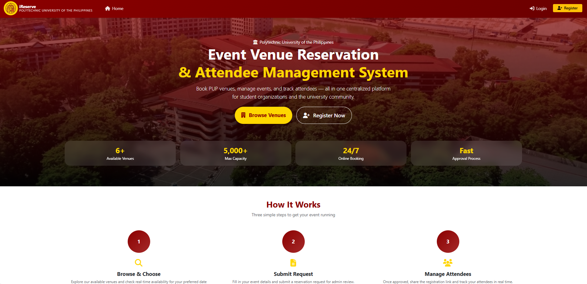

### Available Venues
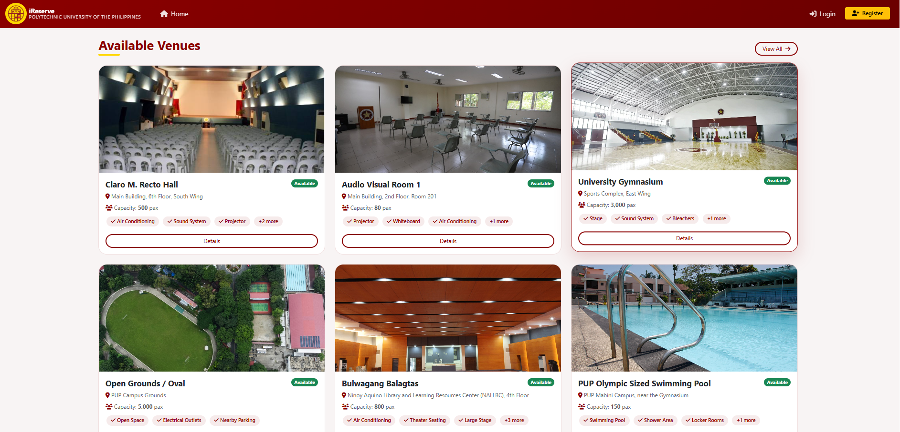

### Sign In
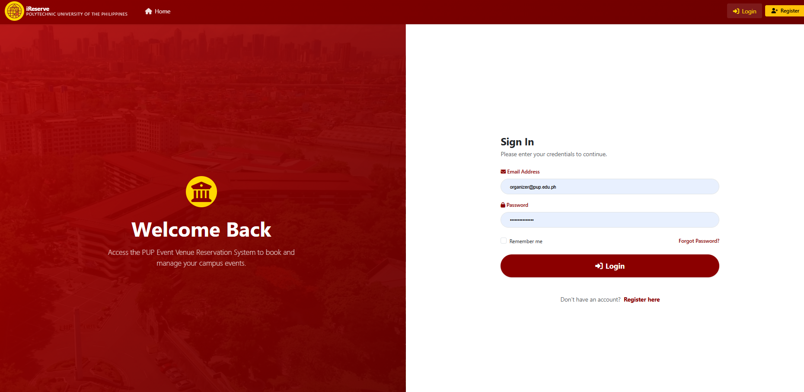

### Sign Up / Register
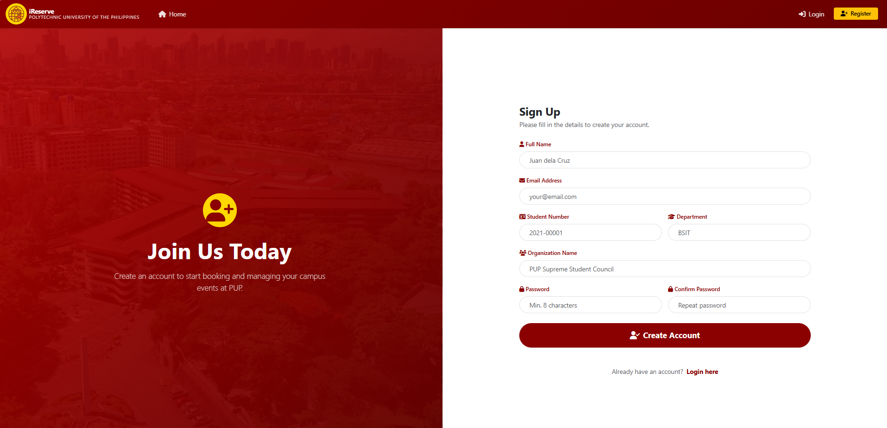

### Organizer Dashboard
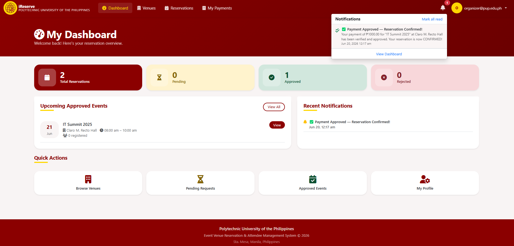

### New Reservation Request
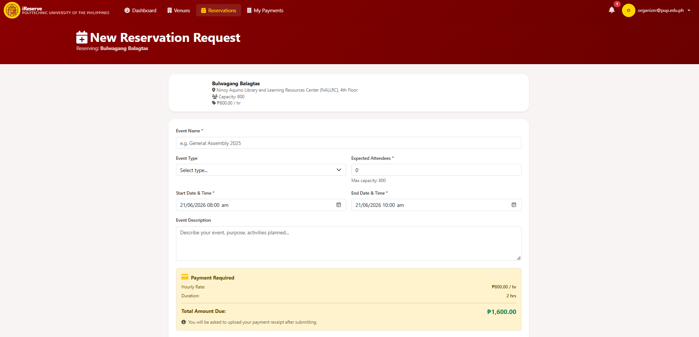

### Organizer Payment Details
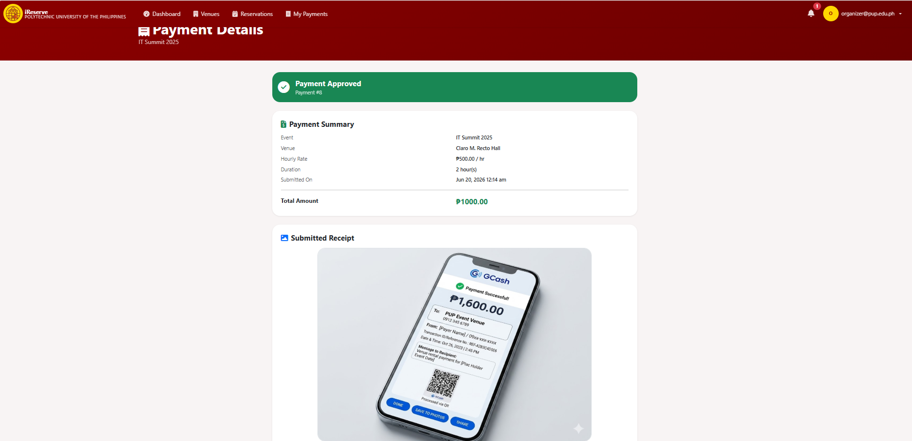

### Admin Dashboard
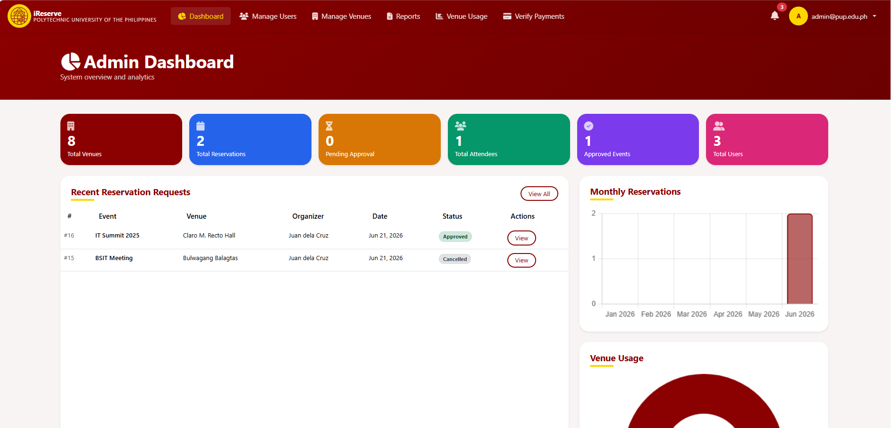

### Event Venue Information
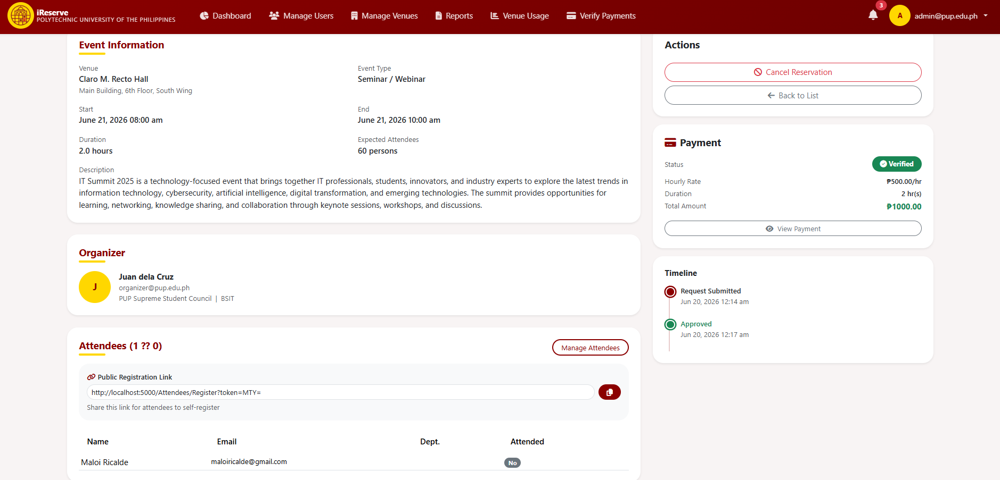

### Venue Usage Monitoring
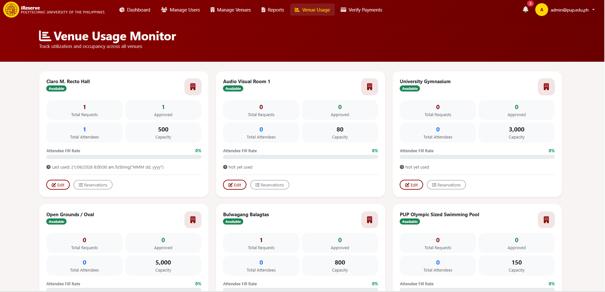

### Payment Verification
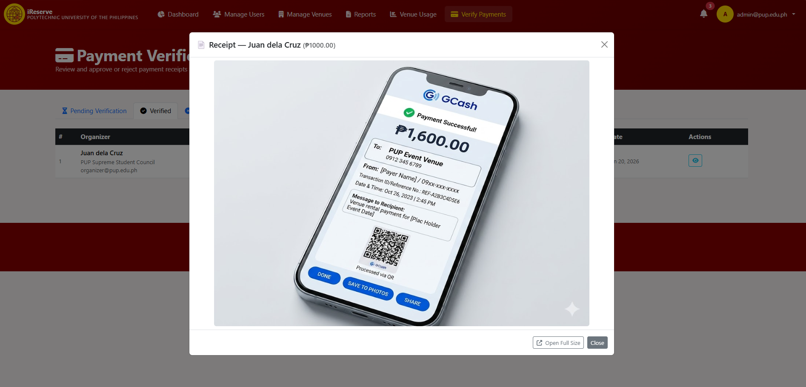

